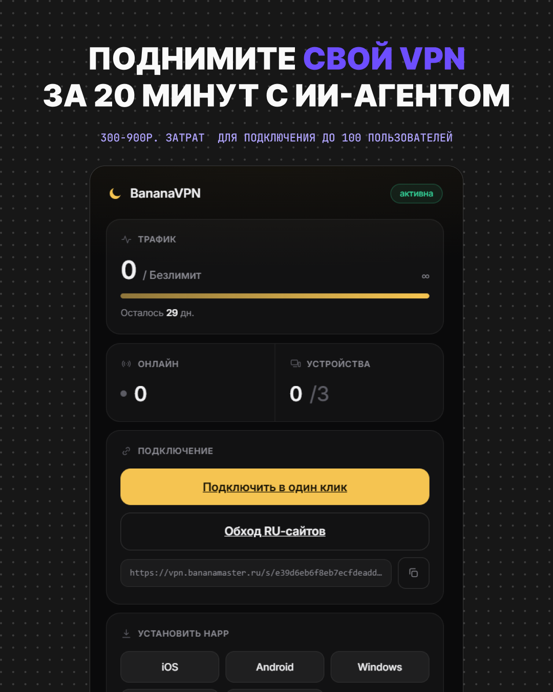
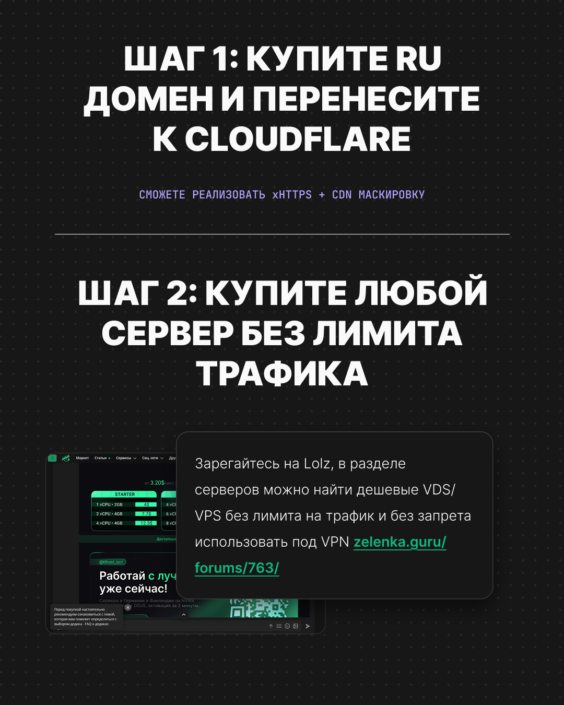
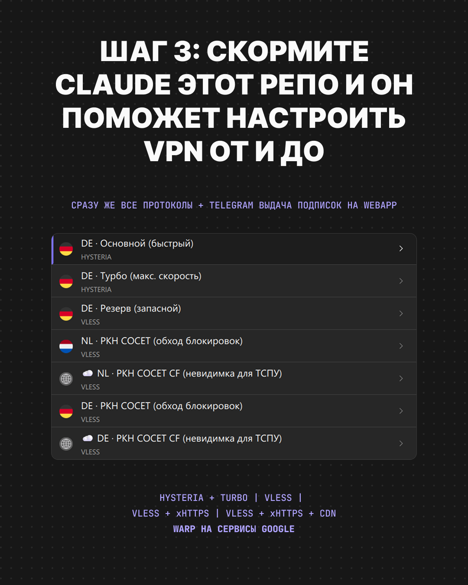

<div align="center">



# BananaVPN

### Свой VPN на своём сервере за 20 минут. Ставит ИИ-агент в Claude Code, ты только вставляешь промпты.

<p>


</p>

Многопротокольный стек против DPI + Telegram-бот выдачи подписок с личным кабинетом и учётом трафика. Список обхода RU-сервисов в комплекте. Никакого ручного допиливания конфигов: даёшь агенту домен и доступ, он поднимает всё сам.

</div>

---

## Что это даёт

<table>
<tr>
<td width="50%" valign="top">

**5 протоколов у каждого пользователя**
- 🟡 Hysteria - основной, быстрый
- 🏎️ Hysteria turbo - максимум скорости
- 🛡️ Reality - запасной канал
- 🌐 XHTTP - durable обход DPI
- ☁️ XHTTP + CDN - прячет IP за Cloudflare

</td>
<td width="50%" valign="top">

**Бот и кабинет из коробки**
- выдача подписок в пару кликов в Telegram
- личный кабинет: трафик, устройства, кнопка подключения
- учёт трафика, лимиты по сроку и устройствам
- список обхода RU (банки, госуслуги, маркетплейсы идут напрямую)

</td>
</tr>
</table>

---

## Как поднять за 20 минут

### Подготовка: домен и сервер

<table>
<tr>
<td width="44%"></td>
<td valign="top">

1. **Домен** на Cloudflare (нужен для узла XHTTP + CDN): A-запись на IP сервера в режиме **Proxied**, SSL/TLS mode **Full**.
2. **VPS** (Ubuntu 22.04+ / Debian 12+, root) - любой провайдер **без лимита трафика**, желательно вне юрисдикции блокировок.
3. **DNS A-запись** домена на IP сервера. Проверка: `dig +short ТВОЙ_ДОМЕН` должен вернуть IP сервера.
4. Токен бота у [@BotFather](https://t.me/BotFather) и свой Telegram id у [@userinfobot](https://t.me/userinfobot).

</td>
</tr>
</table>

### Установка через Claude Code

<table>
<tr>
<td valign="top">

**Куда вставлять промпт:**

1. Установи **[Claude Code](https://claude.com/claude-code)** (`npm i -g @anthropic-ai/claude-code`).
2. Зайди на сервер и запусти агента прямо там:
   ```bash
   ssh root@IP_СЕРВЕРА
   claude
   ```
   (либо запусти `claude` локально, если дашь ему SSH-доступ к серверу).
3. **Вставь промпт ниже прямо в чат Claude Code и нажми Enter.** Агент сам склонирует репозиторий, сгенерит все ключи, поднимет стек, выпустит TLS-сертификат и отдаст ссылку подписки.

</td>
<td width="44%"></td>
</tr>
</table>

> [!TIP]
> Готовые тексты промптов лежат в [`prompts/`](prompts). Можно вставлять их как есть, заменив домен и токены.

**Промпт 1 - поднять VPN-узел:**

```text
Подними VPN-узел из репозитория https://github.com/fsbtactic-code/vpnbanana на этом сервере.
Домен: vpn.ПРИМЕР.com  (DNS A-запись уже указывает на этот сервер).
Склонируй репозиторий в /root/vpnbanana, проверь что A-запись домена ведёт сюда (dig),
затем запусти:  DOMAIN=vpn.ПРИМЕР.com bash /root/vpnbanana/server/install.sh
Дождись завершения и покажи мне ссылку подписки. Если что-то упало - почини и запусти снова.
```

**Промпт 2 - подключить бота выдачи подписок:**

```text
Подключи к узлу vpnbanana Telegram-бота выдачи подписок.
Токен бота: ТОКЕН_ОТ_BOTFATHER
Мой Telegram id: ID_ОТ_USERINFOBOT
Cloudflare-домен для узла XHTTP+CDN (если есть): cdn.ПРИМЕР.com
Запусти bot/install.sh с этими значениями, дождись health-check OK и скажи мне открыть бота и нажать /start.
```

Готово. Открываешь бота, жмёшь **Выдать подписку**, пользователь получает ссылку и личный кабинет.

---

<details>
<summary><b>Установка вручную (без агента)</b></summary>

```bash
git clone https://github.com/fsbtactic-code/vpnbanana /root/vpnbanana && cd /root/vpnbanana

# 1) узел
DOMAIN=vpn.example.com bash server/install.sh

# 2) бот выдачи подписок
BOT_TOKEN=123:abc ADMIN_ID=111111 bash bot/install.sh

# опционально
bash server/warp-egress.sh                          # WARP-выход для гео-AI (Gemini/OpenAI)
PL_HOST=de.example.com bash server/add-location.sh  # вторая локация (на 2-м VPS)
```

`server/install.sh` генерирует все секреты сам и пишет их в `.env` (chmod 600). Скрипты идемпотентны, повторный запуск безопасен. Нестандартные порты задаются через env.

</details>

---

## Структура

```
server/   установка узла: install.sh, шаблоны конфигов, WARP, вторая локация
bot/      Telegram-бот выдачи подписок + FastAPI-кабинет + учёт трафика
rules/    список обхода RU (sing-box / Clash / plain) + генераторы + источники
prompts/  готовые промпты для Claude Code
docs/     стек, модель угроз, клиенты
```

Подробнее о стеке и протоколах: [docs/STACK.md](docs/STACK.md). Клиенты и импорт подписки: [docs/CLIENTS.md](docs/CLIENTS.md).

## Список обхода

RU-сервисы (банки, госуслуги, маркетплейсы, медиа) идут напрямую, мимо VPN, и видят домашний IP. Список открытый, форкай и дополняй: [rules/SOURCES.md](rules/SOURCES.md). Сервер раздаёт его по `/rules/*` для любых клиентов.

## Безопасность

Секретов в репозитории нет: всё генерируется на твоём сервере при установке. Не публикуй `.env`, `db.sqlite`, ключи и реальные ссылки подписок. Модель угроз и дисклеймер: [docs/THREAT-MODEL.md](docs/THREAT-MODEL.md).

## Лицензия

[MIT](LICENSE).
